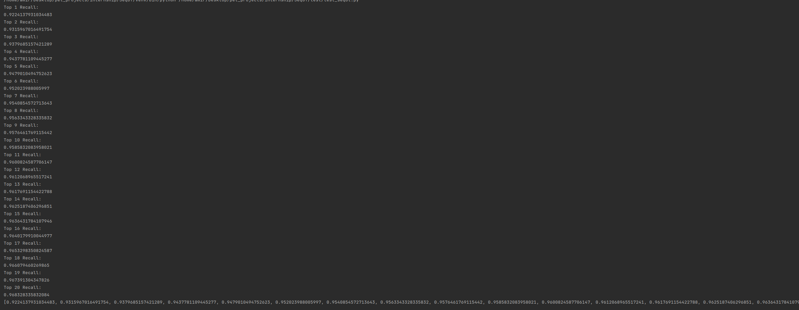

# internship
Repo for internship issues
# Common papers related to Place Recognition

[Lidar-based PR](papers/related_papers/LIDAR_PR.md)

[Transformers](papers/related_papers/Transformers.md)

## Lidar Place Recognition

[CASSPR](papers/LIDAR_place_recognition/casspr.md)

[SeqOT](papers/LIDAR_place_recognition/seqot.md)

## Image-based Place Recognition

[Multi domain](papers/Image_place_recognition/multi_domain_feature_learning_method.md)

[Patch-NETVLAD](papers/Image_place_recognition/Patch-NetVLAD.md)

Вопросы, которые возникли при прочтении статей:
1. Что является глобальной задачей?
2. Какие точности для выходных данных требуются? (К примеру, если нужно выдать координаты. Какая точность от них ожидается?)
3. Как производится скан лидаром (В статьях написано про 2 лидара, которые на выходе выдают сканы 1х32х900 и 1х64х900)

Код использует датасет:

https://robots.engin.umich.edu/nclt/

Для валидации работы трансформера используют 2 сессии из датасета (2012-01-08 и 2012-02-05)
В репе не было ссылки на 2 часть датасета, которая использовалась как `range_image_query_root`, что добавило времени, для запуска.

Также сами данные не являлись ramge_images и сами изоображения нужно генерировать. (Если нужно будет, закину на какой-нибудь диск)

В итоге получились реколы (Правда в выводе не пишет, что это за реколы). Буду разбираться в метриках (Думаю сделать также summary по метрикам и тому, как они форимуруются)

Получилось запустить, но пока не разобрался в том, что происходит под капотом
