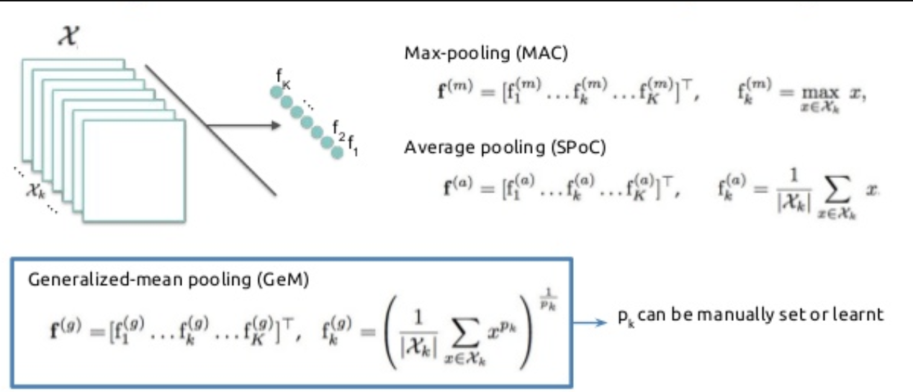

# Seqot

1. Single-Scan Module
2. Multi-Scan Module
3. Pooling

## Preprocessing

Lidar scan -> range image (1)

(Каждая точка лидарного скана (x,y,z) переводится в пиксельные координаты (u,v))

## Single-scan module
Далее через OverlapNetLeg иззображение сворачивается в набор векторов C × 1 × W, 

где W - ширина изоображения, C - количество каналов кодируeмой фичи (есть описание только в OverlapTransformer. Надо лезть в код и посмотреть)

Вектор передается в Single-Scan трансфомер, где он при проходит через 3 блока как показано рисунке ниже

Далее результат трансформера объединяется с исходным набором векторов (C × 1 × W). Через данный модуль проходит M сканов и передается в Multi-Scan Module (В статье M == 3)

## Multi-Scan Module

На входе сканы с single-scan модуля объединяются в "Тензор" размерности 2c × 1 × 3w. 
Далее над входным тензором применяется self-attention механизм , который передается в MLP, далее в NETVLAD

## Pooling

Результаты NETVLAD передаются в pooling модуль и на выходе получается вектор размерности 1 × 256, который является вектором глобальных дискрипторов. (Как именно идет выборка показано на рисунке ниже) 

## NETVLAD

NetVlad

### Note

Single-scan и multi-scan трансофрмеры имеют одну и ту же архитектуру, но играют разные роли.

Single-scan модуль предназначен для использования пространственной информации одного сканирования и создания промежуточного признака для каждого сканирования.

Multi-scan модуль работает с конкатенированными признаками из трех последовательных наблюдений, уделяя особое внимание взаимосвязи временных признаков.

- Архитектура
  1. multi-head self-attention (MHSA)
  2. feed-forward network (FFN)
  3. layer normalization (LN)

! - TODO: почитать про метрики, изпользующиеся при PR

В репе есть предобученные веса для модели, но они разделени на модули (что очень неудобно), также изоображение из лидарных данных не лежат где-то, а генерируются на локальной машине. Для генерации на диске лежит сырые лидарные данные (Насколько я понял) и качаться они будут 30 часов с скоростью в 70~80 кб/с.
! - TODO: посмортеть, есть ли метрика по повороту и смещению относительно кадров

