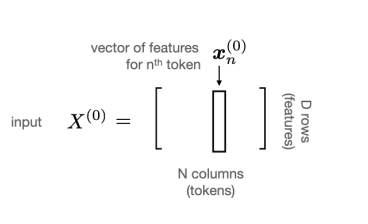
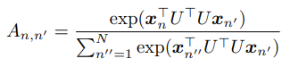

# Transformer Обзор

## Принцип работы

Трансформеры работают с данными в формате последовательности N векторов длины D, как показано на рис.1.

Рисунок 1 - Вход трансформеров

Пример кодирования изоображения

## Блок трансформера

### 1 стадия:

Независимо очищает/улучшает (По контексту не до конца понятно) каждую фичу независимо относительно отношений между токенами через всю последовательность
- Пример: Насколько сильно слово на позиции n в последовательности зависит от предыдущих слов в позиции n'

Эта стадия распростроняется горизонтально по строкам

### 2 стадия:

Эта стадия распростроняется вертикально по колонкам среза X^(m-1) повторно применяя блок трансформера => представление токена n и фичи d, может быть сформировано из токена n' и фичи d'

# Стадия 1: Self-attention across the sequence

`Attention`:
Выходной вектор для позриции n, обозначается за Y_n^(m) (Получается простым взвешанным средним в позиции n' = 1...N, обозначенной X_N^(m), что видно в формуле 1)

В формуле испольуется матрица внимания, A_{nxn}, сумма столбцов которой равны 1. 

`Note`: для позиций, имеющих большую значимость для n-ого вектора (к примеру предыдущий веткор n') матрица внимания будет принимать большие значения, нежели в незначимых позициях последовательности.

Отношение между входным вектором и выходным будет иметь вид:

Также пример можно увидеть на рис.2.

Рисунок 2 - Пример выходного вектора Y после прохождения 1 блока трансформера

Сама матрица внимания получается из входной матрицы данных (после преобразования в последовательность векторов)

Построение такой матрицы связывает информацию о сходстве между "местами" ("locations" - столбцы тензора (можно рассматривать как вектора)) в последовательности с содержанием самой последовательности. Альтернативаный подход для построения матрицы "внимания" показан на рисуноке ниже. Он использует те же самые опреации, но на линейном преобразовании последовательности 

где U -KxD, K < D

В такой реализации появляется проблема - связь между последовательностями будет симметрична, к примеру нужно связвать ножницы -> инструмент сильной ассоциацией, но по симметричной ассоциации инструмент обязательно будет иметь сильную ассоциацию с ножницами. (То есть для трансформера ножницы это инструмент, но интсрумент не олязательно должен быть ассоциирован с ножницами)
Для решения этой проблемы будет введены 2 ассиметричные линейные трансформации, как показано на рисунке ниже

